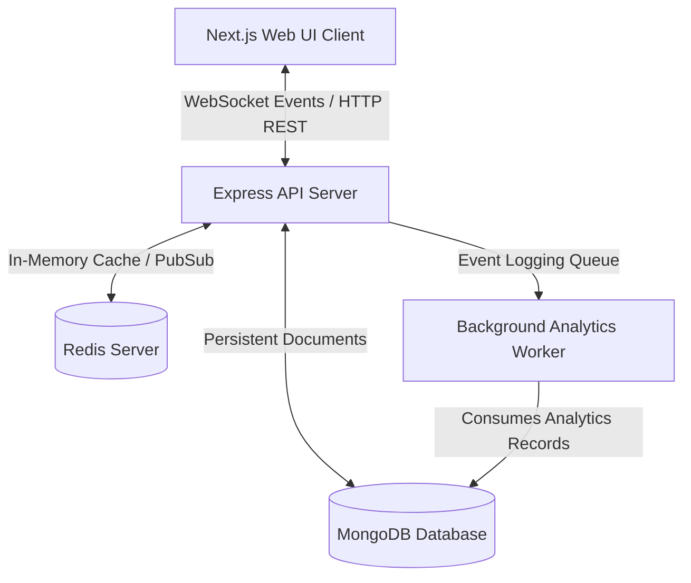

# LiveQuiz: System Architecture Documentation

This document describes the high-level system architecture, component relationships, data persistence strategies, and real-time communication diagrams of the LiveQuiz application.

---

## 🏛️ System Component Topology

LiveQuiz is designed as a distributed, decoupled multi-service application consisting of four primary structural components:



---

## 🛠️ Service Layers & Tech Stack

### 1. Web client layer (Frontend)
- **Framework**: Next.js (App Router)
- **State Management**: Redux Toolkit (auth slices, quiz collections, conductor sessions)
- **Real-Time Client**: `socket.io-client` (persistent WebSocket client connecting to the API Gateway)
- **Styling**: Tailwind CSS v4 (with custom `@variant light` contrast styles for full dark/light theme support)

### 2. API Gateway & Socket Server Layer (Backend)
- **Runtime**: Bun (TypeScript engine execution)
- **Web framework**: Express (REST Endpoints for Auth, Quiz CRUD, and Session Logs)
- **WebSocket engine**: Socket.io (manages client connections, namespaces, and room subscriptions)
- **Worker thread**: Background worker executing calculations and syncing player accuracy to MongoDB

### 3. Cache & In-Memory Store Layer (Redis)
- **Session state storage**: Stores active player scores, profiles, and leaderboard scores inside Redis Hashes and Sorted Sets (`players:${code}`, `leaderboard:${code}`) for sub-millisecond responses.
- **WebSocket Rooms routing**: Synchronizes message publishing across API worker instances.

### 4. Relational Documents Layer (MongoDB)
- **Data storage**: Handles durable schemas for Users, Quiz structures, and historic Session Analytics collections.

---

## 🔄 Real-Time Live Quiz Gameplay Lifecycle

The following sequence illustrates the event-driven communication loop when a participant joins a lobby, answers a question, and scores points:

```mermaid
sequenceDiagram
    autonumber
    actor Participant as Player Client
    actor Host as Host Client
    participant API as API Server
    participant Redis as Redis Cache
    participant DB as MongoDB

    %% Phase 1: Game Launch & Joining
    Host->>API: POST /api/v1/sessions/:code/publish (Launch Live)
    API->>DB: Set Quiz isPublished = true
    API->>Redis: Initialize session:{code} structure
    API-->>Host: Launch Code returned
    Participant->>API: Socket connection & joinRoom (PIN)
    API->>Redis: Set player profile players:{code}
    API->>Host: Broadcast PLAYER_JOINED event
    
    %% Phase 2: Host starts question
    Host->>API: POST /api/v1/sessions/:code/next (Start Q1)
    API->>Redis: Update session:{code} status = active
    API-->>Participant: Broadcast QUESTION_CHANGED (Q1 metadata, choices)
    
    %% Phase 3: Player submits answer
    Participant->>API: POST /api/v1/sessions/:code/submit (Option A, Time remaining)
    API->>Redis: Check correctOptionIndex & calculate score
    API->>Redis: Increment score in ZSET leaderboard:{code}
    API->>Redis: Record player answer object
    API-->>Participant: Return answer feedback (IsCorrect, points)
    
    %% Phase 4: Leaderboard display
    Host->>API: GET /api/v1/sessions/:code/leaderboard
    API->>Redis: ZREVRANGE leaderboard:{code} (Get top ranks)
    API-->>Host: Return real-time Leaderboard score state
```

---

## 💾 Cache Storage Structure (Redis Key Mappings)

To achieve fast lookup and ranking calculations, Redis stores active game data using three distinct key namespaces:

1. **Session configuration (`session:${code}`)**:
   - Data Type: `Hash`
   - Fields: `quizId`, `quizTitle`, `status` (`waiting` | `active` | `completed`), `currentQuestionIndex`.

2. **Player records (`players:${code}`)**:
   - Data Type: `Hash`
   - Fields: `{playerId}: JSON.stringify({ id, nickname, score, answers: [] })`.

3. **Leaderboard index (`leaderboard:${code}`)**:
   - Data Type: `Sorted Set (ZSET)`
   - Score: Player score (points)
   - Value: `nickname` (Enables automated sorting and ranked queries via `ZREVRANGE`).
